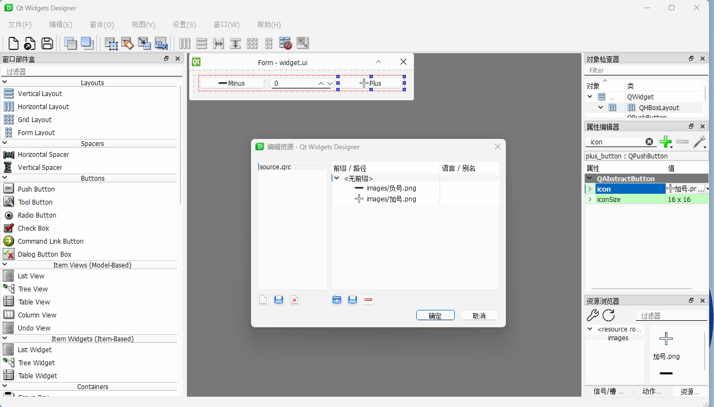

# Qt Designer

通过Qt Designer软件绘制ui界面，绘制完毕另存为.ui文件

<figure><figcaption></figcaption></figure>

在python代码中加载.ui界面，并通过objectName获取对应组件。

```python
import sys
from PySide6 import QtWidgets
from PySide6.QtUiTools import QUiLoader

loader = QUiLoader()    #setup a loader object

app = QtWidgets.QApplication(sys.argv)
window = loader.load("widget.ui", None) #Load the ui

def fun():
    print(f"{window.name_line_edit.text()} is a {window.job_line_edit.text()}.")

window.commit_button.clicked.connect(fun)
window.show()
app.exec()

```

<figure><figcaption></figcaption></figure>
